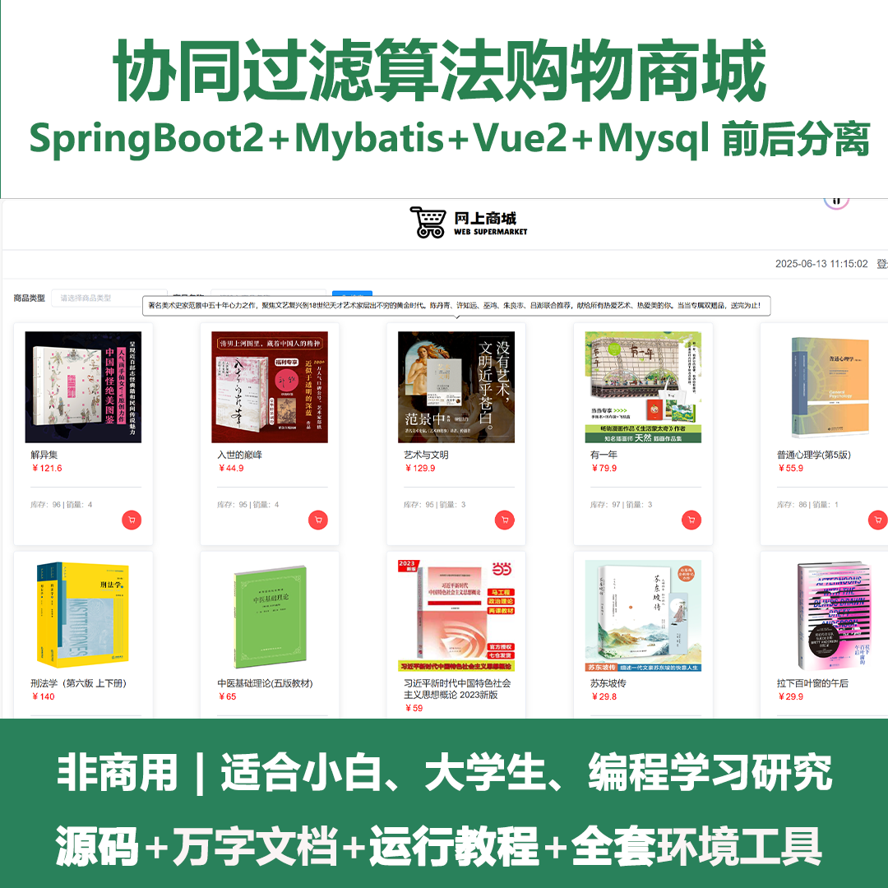
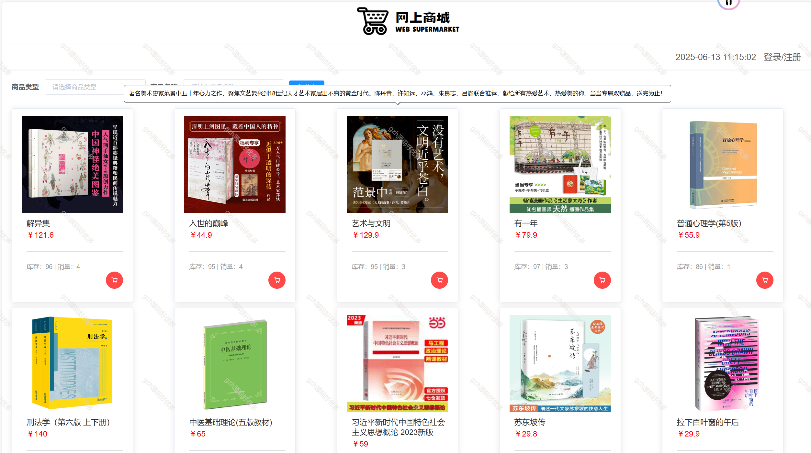
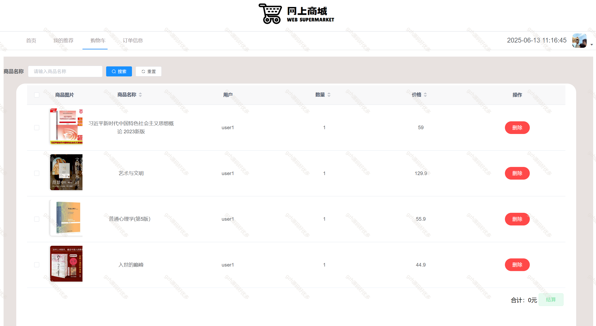
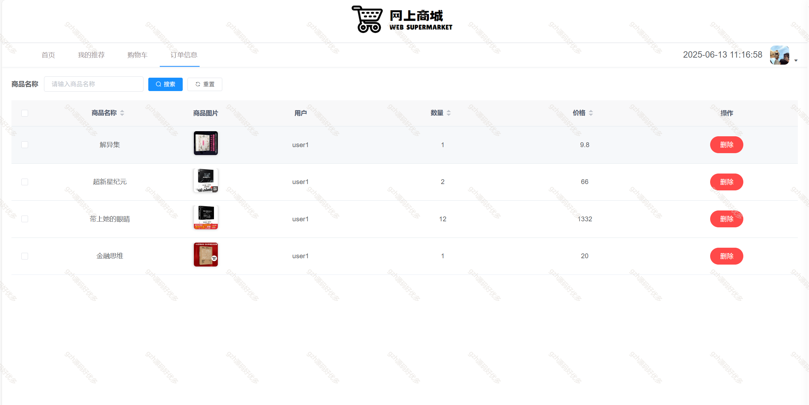
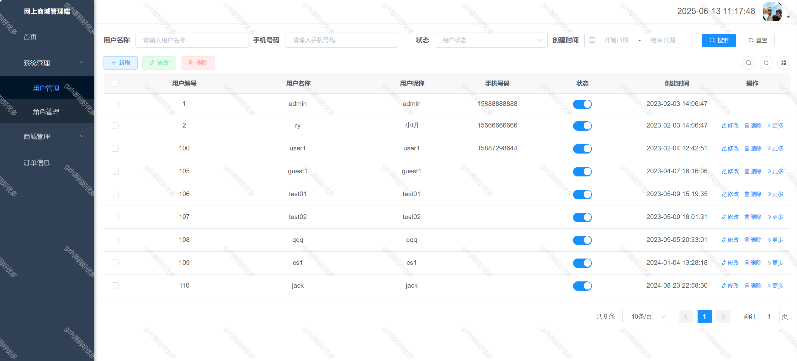
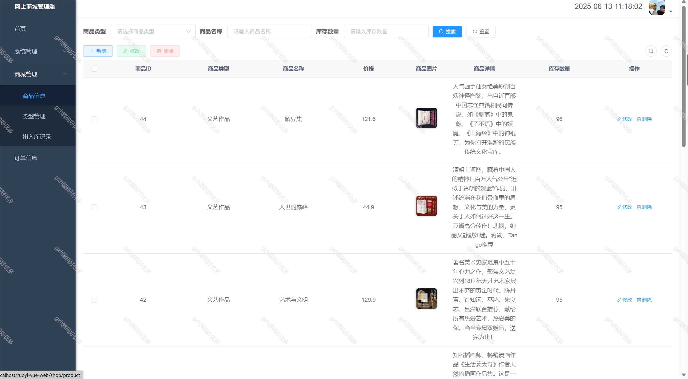
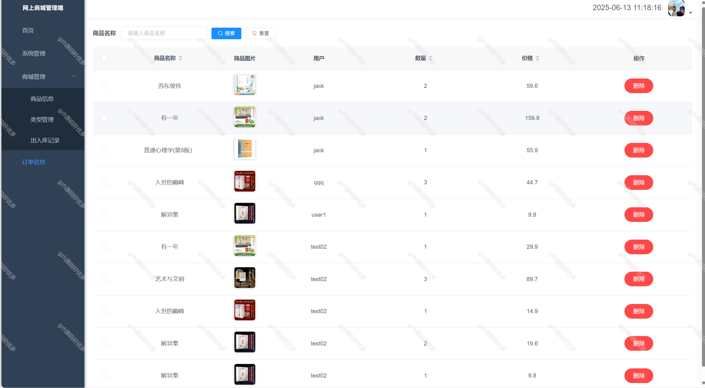
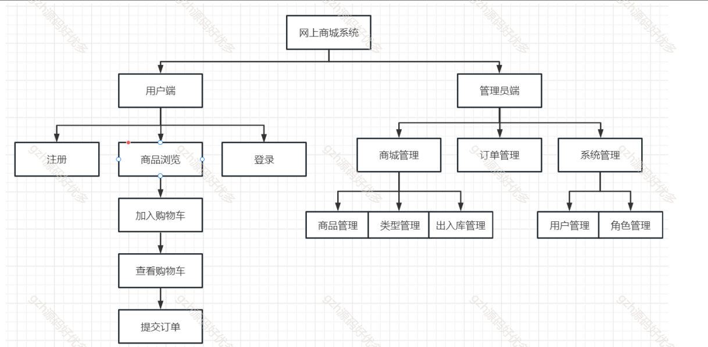

# springbootA380
springbootA380基于若依的协同过滤算法购物商城图书商城系统
 
## 查看主页获取源码

### 一、关键词

购物商城，协同过滤算法、若依、图书商城系统

 

### 二、作品包含

源码+数据库+万字文档+全套环境和工具资源+部署教程

 

### 三、项目技术

前端技术： vue2 Element Plus Axios Echarts
后端技术：Java、SpringBoot2.0、MyBatis

  

 

### 四、运行环境（以下版本亲测，其他版本未知，请自测）

开发工具：IDEA/eclipse  + VSCODE

数据库：MySQL8

数据库管理工具：Navicat10以上版本

环境配置软件： JDK17 + Maven3.6.3

前端Nodejs：16

浏览器：谷歌浏览器

 

### 五、项目介绍

项目编号：springbootA380

伴随着Internet的蓬勃发展，电子商务也取得了突飞猛进的发展。电子商务是在互联网开放环境下，基于浏览器/服务器应用方式，实现消费者的网上购物、商户之间的网上交易和在线电子支付的一种新型的商业运作模式。不同领域的电子商务网站的建立，给人们的生活带来了巨大的影响。本论文就此网上书城系统进行了详细全面的论述

1用户模块：
（1）登录功能
为了使系统具有良好的人机界面，系统用户界面布局显然做的功能布局，空间分配，平衡和一致的界面结构和风格。
（2）订购商品功能
此功能包括了五部分：浏览商品，推荐商品，加入购物车，查看购物车，查看订单。

管理员模块：
（1）登录功能
管理员进入系统，需要提供正确的用户名和密码。 
（2）用户管理功能
管理员登录成功后，进入用户管理界面，可以分页浏览所有用户，查看用户详情，修改用户信息，删除用户。
（3）角色管理功能
角色管理可以查看当前系统的所有角色，和其对应的功能权限，可以对权限进行修改，新增角色，删除角色等功能。
（4）类别管理功能
对类别可以进行增删改查处理
（5）商品管理功能
管理员对商品的管理主要是，分页查看所有商品，新增商品，修改商品信息，删除商品信息。
（6）出入库管理功能
管理员对商品进行出库、入库，对应的就是商品的库存的增加与减少。
（7）订单管理功能
管理员可以查看所有的订单的信息，并可进行删除。

 

### 六、运行截图

